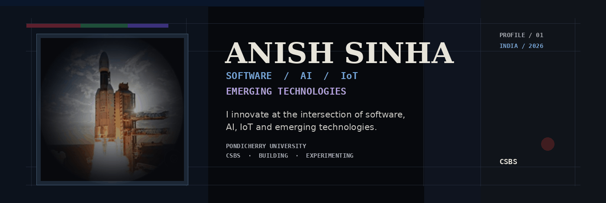
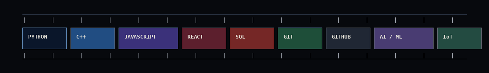

<div align="center">



</div>

<br>

<div align="center">

**SOFTWARE** &nbsp;/&nbsp; **AI** &nbsp;/&nbsp; **IoT** &nbsp;/&nbsp; **EMERGING TECHNOLOGIES**

<br>

> I innovate at the intersection of software, AI, IoT and emerging technologies.

</div>

---

## 01 — ABOUT

<table>
<tr>
<td width="58%" valign="top">

I'm a **Computer Science & Business Systems** student at **Pondicherry University**. I like understanding systems from the inside, turning rough ideas into working prototypes, and learning by building.

**Focus**

`Artificial Intelligence`  
`Software Engineering`  
`IoT & Connected Systems`  
`FinTech`  
`Defence / Emerging Technology`

</td>

<td width="42%" valign="top">

```python
class AnishSinha:
    education = "B.Tech–MBA | CSBS"
    university = "Pondicherry University"

    interests = [
        "AI / ML",
        "IoT",
        "Software",
        "FinTech"
    ]

    mindset = [
        "build",
        "experiment",
        "iterate"
    ]
```

</td>
</tr>
</table>

---

## 02 — STACK / SYSTEMS

<div align="center">



<br>


</div>

**Core** — Python · C++ · JavaScript · SQL  
**Development** — React · Flask · Node.js · Android Studio  
**Tooling** — Git · GitHub · VS Code · Linux · Postman  
**Exploring** — AI/ML · IoT · Computer Vision · FinTech

---

## 03 — COMMUNITIES

<div align="center">

| | |
|:--|:--|
| **GDG** | Developer community |
| **FOSS United** | Open source community |
| **E-Cell IIT Bombay** | Entrepreneurship community |

</div>

---

## 04 — GITHUB / TELEMETRY

<div align="center">


<br><br>


</div>

---

## 05 — ACTIVITY

<div align="center">


</div>

---

## 06 — CONTRIBUTION TRAIL

<div align="center">


</div>

---

## 07 — ACHIEVEMENTS

<div align="center">


</div>

---

## 08 — NOTE

<div align="center">

**Build first. Question assumptions. Keep iterating.**

</div>

---

## 09 — NETWORK

<div align="center">

<a href="https://github.com/iamanishsinha"></a>
<a href="https://www.linkedin.com/in/anishsinhaprofile/"></a>
<a href="YOUR_X_URL"></a>
<a href="YOUR_PORTFOLIO_URL"></a>
<a href="mailto:YOUR_EMAIL@example.com"></a>

</div>

<br>

<div align="center">


</div>
